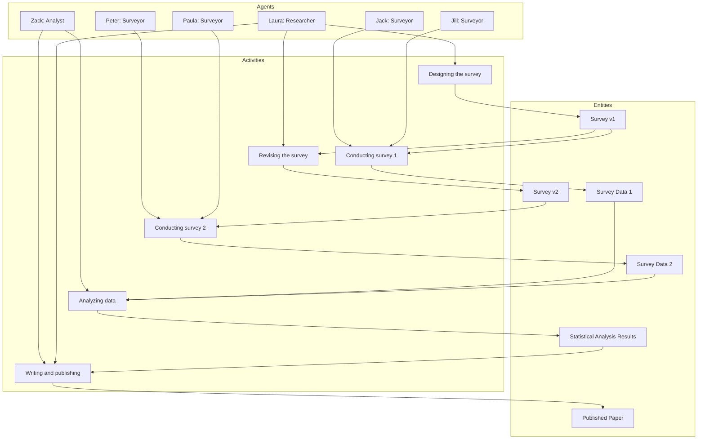

# Survey Data Analysis Toolkit

This repository contains the results for the Practical Exercises 1 and 2 of the "Scientific Paper of the Future" training.

## Practical Exercise 1: Software Preservation and Citation

This repository is documented following best practices for software sharing:
- **License**: MIT License.
- **Metadata**: [codemeta.json](codemeta.json) provides machine-readable metadata.
- **Citation**: See the Citation section below.
- **DOI**: A DOI will be assigned by Zenodo upon the first tagged release.

## Practical Exercise 2: Representing Provenance

The provenance of the survey results is represented in the [provenance.prov](provenance.prov) file and the diagram below.

### Provenance Diagram (Mermaid)

## Citation

To cite this software, please use the following metadata:

Sami Abar. (2026). Survey Data Analysis Toolkit (v1.0.0). Zenodo. https://doi.org/10.5281/zenodo.XXXXXXX
